# Motivation

- Workplace charging is becoming important as EV adoption grows.
- Office buildings are a strong use case because parking duration is long and daily patterns are predictable.
- Rooftop PV creates an opportunity to align charging demand with local renewable generation.
- The central question is how much charging intelligence is actually worth in practice.

# Research Objective

- Evaluate smart EV charging strategies for a single office building with rooftop PV, stationary storage, and a constrained grid connection.
- Compare three intelligence levels reported in the current thesis results:
  - Level 0: simple rule-based charging
  - Level 1: reinforcement learning based optimization
  - Level 2: RL with V2G enabled
- Measure economic, operational, and renewable-integration performance.
- Validate findings over a full annual simulation (365 days of 2018 data).

# Case Study Setup

- Building demand: mean 6.73 kW, peak 11.92 kW, annual energy 58,992 kWh
- PV system: 150 m² rooftop array, 30 kW peak, annual production 44,908 kWh
- Building battery: 80 kWh, 95% efficiency, 50 kW max charge/discharge
- EV fleet: 15 vehicles, 100 kWh battery each, 22 kW charging, 22 kW V2G capability
- Mobility pattern: arrivals 06:00–09:00, departures 16:00–20:00, target departure SoC 70–80%
- Grid connection: 80 kW limit with day-ahead French wholesale prices

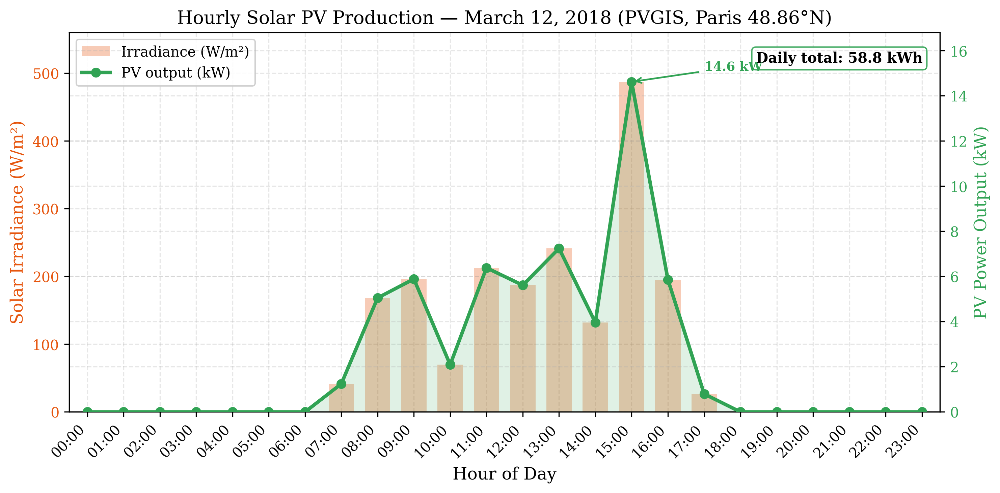{width=72%}

# Why Office Buildings

- Daily occupancy patterns make arrival and departure times relatively predictable.
- Long parking windows provide flexibility to shift charging in time.
- Office hours overlap with solar production, improving self-consumption potential.
- Charging is easier to coordinate centrally than in fully decentralized home charging.

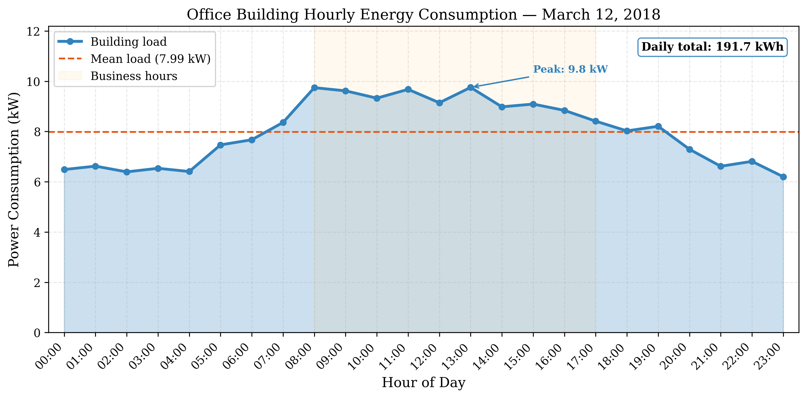{width=72%}

# Methods Compared

| Level | Strategy | Main idea | Practical cost |
|---|---|---|---|
| 1 | Simple rules | Charge with available capacity using a deterministic policy | Very low |
| 2 | RL (Q-learning) | Learn when to delay or prioritize charging | Moderate |
| 3 | RL + V2G | Add discharge decisions and possible arbitrage | Highest |

- All methods were tested on the same 15-EV office-building scenario.
- Full annual simulation: 365 days using real 2018 French wholesale prices and PVGIS solar data.

# RL training convergence (representative day)

- Charge-only Q-learning: 15,000 episodes per decision hour; March 12, 2018 (Paris) load, PV, and EPEX prices.
- Moving average shows reward stabilising after ~8,000–10,000 episodes as the policy learns load shifting and solar alignment.
- Operational results in the thesis use the converged policy; vs Simple on the same day, electricity cost drops **3.7%** (€31.63 → €30.45).

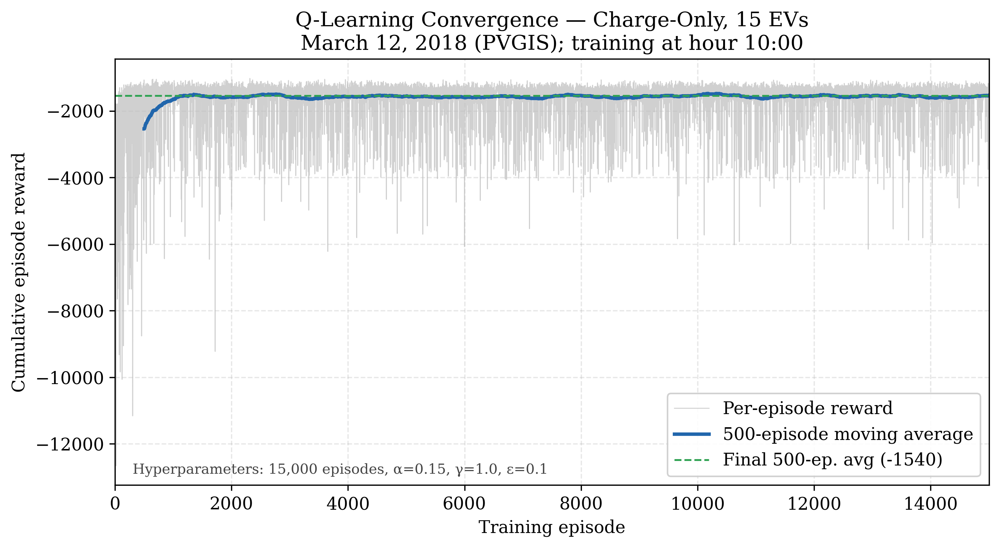{width=88%}

# Annual Charge-Only Results (365 Days)

| Method | Avg Daily Cost (€) | Annual Cost (€) | Annual Savings (€) | Savings (%) |
|---|---:|---:|---:|---:|
| Simple | 29.79 | 10,873 | --- | --- |
| RL | 29.46 | 10,753 | 120 | 1.1% |

- RL reduces annual charging cost by €120 (1.1%) compared to the simple controller.
- Both methods satisfy the 80 kW grid limit with zero violations across all 365 days.
- Zero SoC violations: all vehicles reach target departure charge every day.

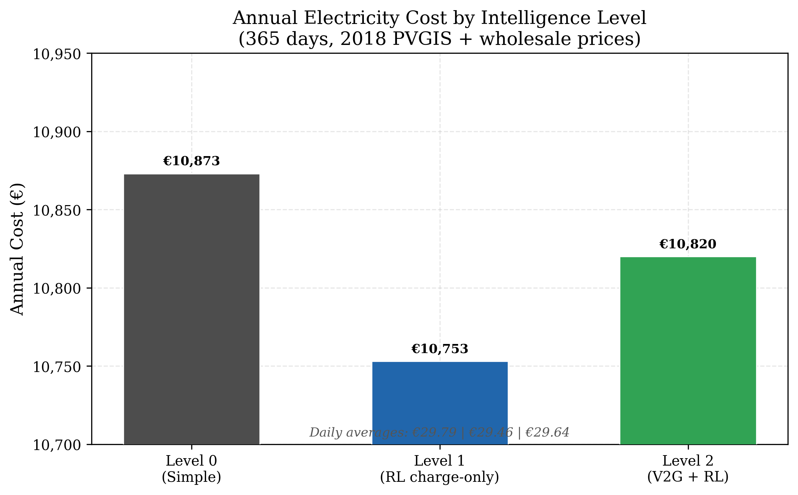{width=82%}

# Annual savings vs Simple (365 days)

- Charge-only RL saves **€120/year**; V2G RL saves **€53/year** vs the same Simple baseline.
- V2G RL is more expensive than charge-only RL because wholesale arbitrage never activates.

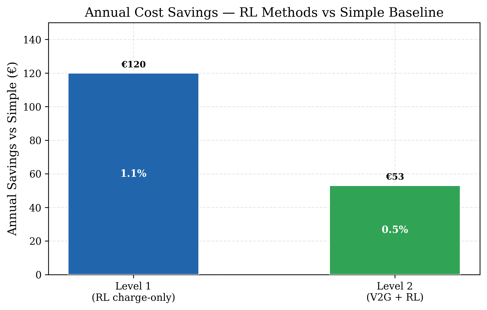{width=72%}

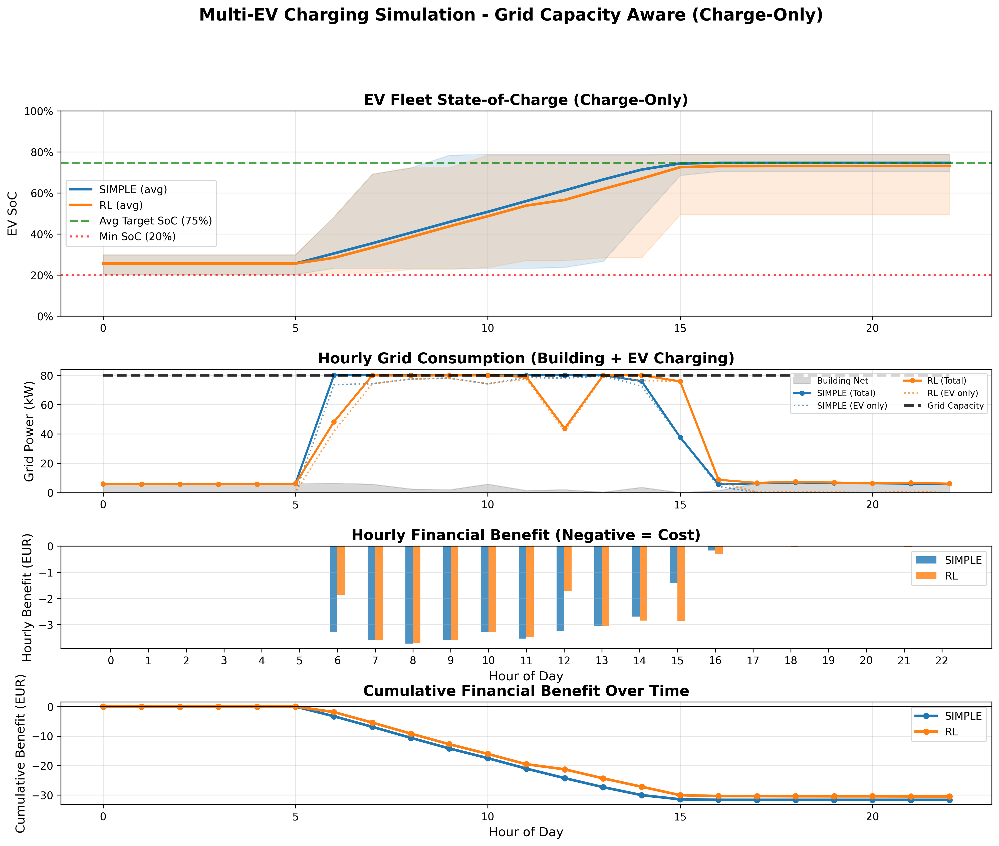{width=80%}

# Annual Energy Performance

| Method | Daily Solar Used (kWh) | Daily Grid Energy (kWh) | Daily Energy Charged (kWh) | Cost/kWh (€) |
|---|---:|---:|---:|---:|
| Simple | 57.9 | 677.9 | 735.8 | 0.0440 |
| RL | 59.4 | 671.6 | 731.1 | 0.0439 |

- RL uses 2.6% more solar energy daily (59.4 vs 57.9 kWh) by better aligning charging with PV production.
- RL reduces grid energy consumption by 0.9% (671.6 vs 677.9 kWh/day).
- Annual grid energy: Simple 247,420 kWh vs RL 245,150 kWh — a reduction of 2,270 kWh/year.

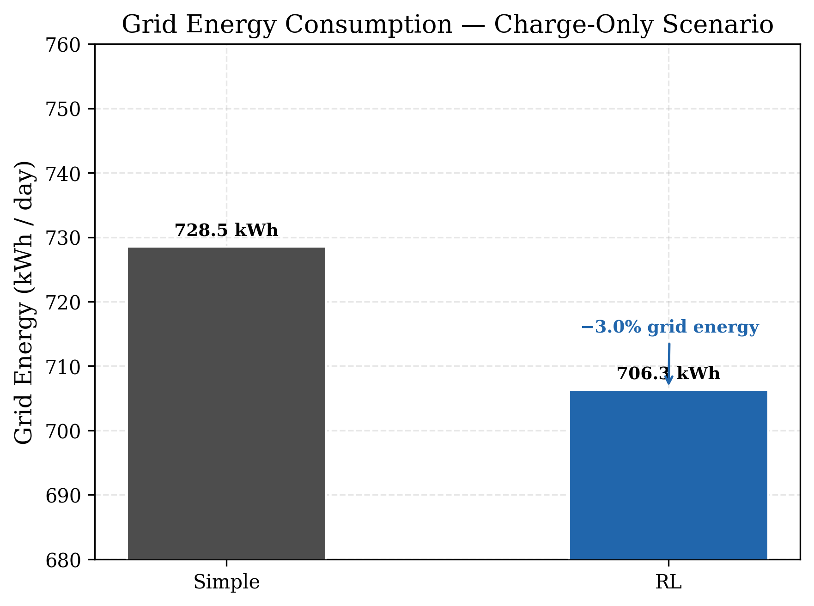{width=78%}

# Solar Self-Consumption

| Scenario | Solar Self-Consumption (%) |
|---|---:|
| No EVs (building only) | 49.6% |
| With EVs — Simple | 96.7% |
| With EVs — RL | 97.9% |

- EVs nearly double solar self-consumption from 49.6% to over 96%.
- RL further improves self-consumption by 1.2 percentage points over Simple.
- Daily solar production: 123.0 kWh, of which 61.0 kWh is used by the building.

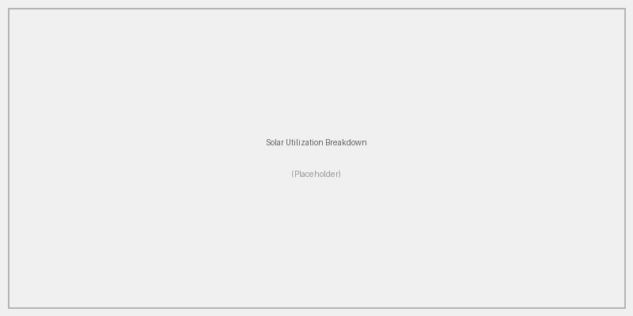{width=78%}

# Annual V2G Results

| Method | Avg Daily Cost (€) | Annual Cost (€) | Savings vs Simple (€) |
|---|---:|---:|---:|
| V2G Simple | 29.79 | 10,873 | 0 |
| V2G RL | 29.64 | 10,820 | 53 |

- V2G RL saves €53/year vs Simple — less than Charge-Only RL (€120/year).
- V2G RL is €67/year more expensive than Charge-Only RL.
- Zero V2G revenue, zero energy discharged across all 365 days.
- The V2G capability provides no additional economic benefit at wholesale prices.

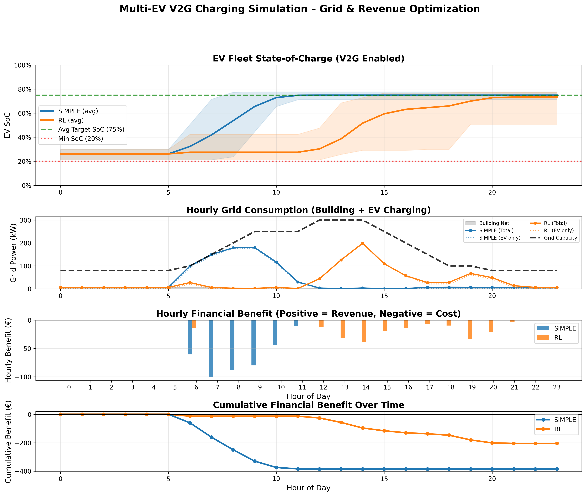{width=80%}

# V2G Sell-Price Sensitivity (365 Days, 2018)

| Sell Price | V2G Simple Cost (€) | V2G RL Cost (€) | V2G Revenue (€) | V2G Discharged (kWh) |
|---|---:|---:|---:|---:|
| 80% of buy | 29.79 | 29.64 | 0.00 | 0.0 |
| 100% of buy | 29.79 | 29.64 | 0.00 | 0.0 |
| 120% of buy | 29.79 | 29.64 | 0.00 | 0.0 |

- Three sell-price scenarios tested: 80%, 100%, and 120% of the wholesale buy price.
- Result: **zero V2G discharge across all scenarios and all 365 days**.
- Even at 120% sell-back, wholesale prices (€0.01–0.06/kWh) are too low for profitable arbitrage.
- The RL agent correctly learns that round-trip losses exceed any potential gain.

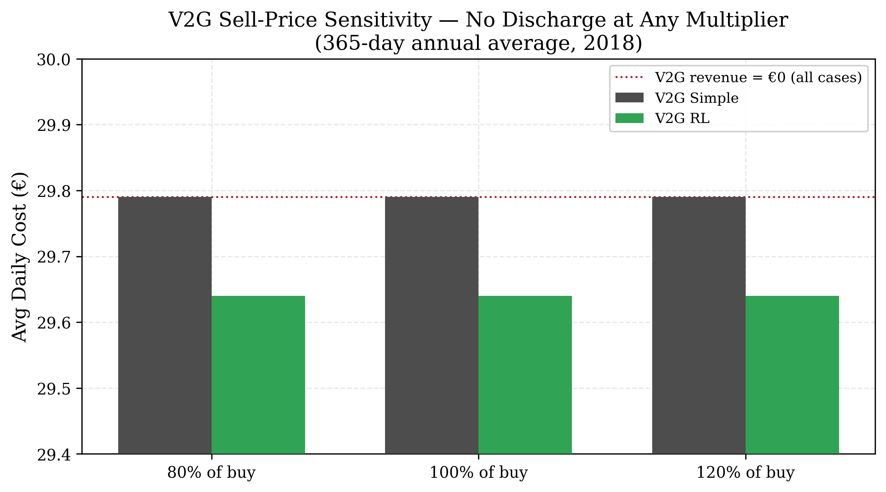{width=86%}

# Why V2G Fails at Wholesale Prices

- Wholesale prices in France (2018) range €0.01–0.06/kWh — extremely low absolute levels.
- Even a 20% premium on sell-back produces only ~€0.01/kWh margin.
- Round-trip battery efficiency losses (5–10%) consume any theoretical profit.
- The RL agent prioritises maintaining departure SoC over speculative discharge.
- **For V2G to be viable, at least one condition must be met:**
  1. Retail-level prices (€0.15–0.30/kWh) to create sufficient spread
  2. Greater intraday price volatility (peak-to-trough differential)
  3. Ancillary service payments (frequency regulation, capacity markets)

# Economic Comparison Across All Levels

| Level | Method | Avg Daily Cost (€) | Annual Cost (€) | Annual Savings (€) |
|---|---|---:|---:|---:|
| 1 | Simple rules | 29.79 | 10,873 | --- |
| 2 | RL (Q-Learning) | 29.46 | 10,753 | 120 |
| 3 | RL + V2G | 29.64 | 10,820 | 53 |

- Level 2 (Charge-Only RL) delivers the best economic outcome: €120/year saved.
- Level 3 (V2G RL) underperforms Level 2 by €67/year — V2G adds cost, not value.
- Savings are modest but consistent across all 365 days of simulation.

# Sensitivity to electricity price scenarios (charge-only)

- Under a **flat** tariff, Simple and RL coincide; RL’s value grows when intraday **variability** increases.
- RL widens its advantage under high ±100% variation vs the Simple baseline.

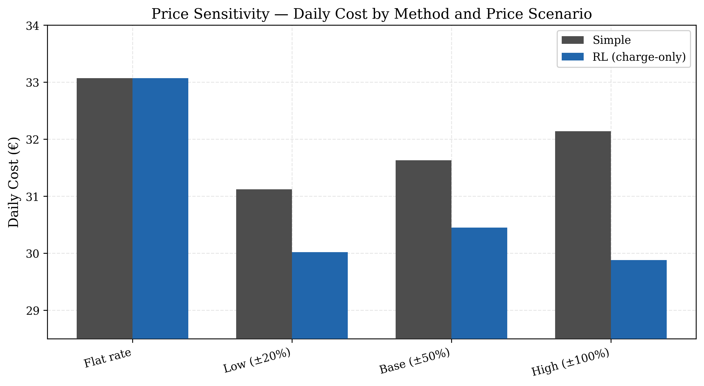{width=88%}

# Economic comparison (bar chart)

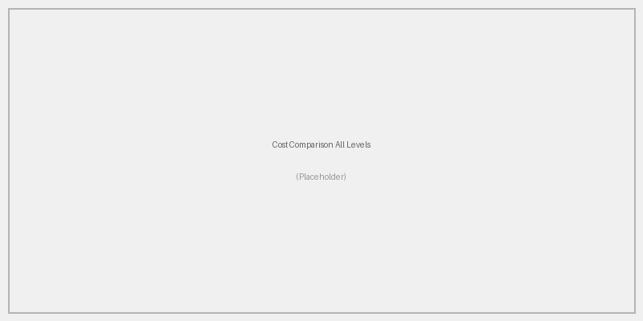{width=78%}

# State of Charge Statistics (Annual Average)

| Method | Mean SoC | Min SoC | Max SoC | Std Dev |
|---|---:|---:|---:|---:|
| Simple | 74.7% | 70.5% | 78.9% | 2.9% |
| RL (Charge-Only) | 74.4% | 67.2% | 78.9% | 3.6% |
| RL (V2G) | 74.7% | 70.4% | 78.9% | 2.9% |

- All methods achieve mean departure SoC within the 70–80% target range.
- RL charge-only shows slightly more SoC variation (std 3.6%) — the agent trades off SoC margin for cost savings.
- V2G RL maintains tighter SoC control (std 2.9%), similar to Simple, because it avoids discharge.

# Key Interpretation

- Smart charging helps, but the annual improvement from Level 1 to Level 2 is modest (1.1%).
- Rule-based control already performs well because the office scenario is structured and predictable.
- RL is most attractive when fleet size grows or operating conditions become more complex.
- V2G depends strongly on absolute price levels and tariff design — not algorithm sophistication.
- The sell-price sensitivity analysis (80%, 100%, 120%) conclusively shows zero V2G activity at wholesale prices.

# Practical Recommendations

- Use Level 1 rule-based charging for small fleets or low-complexity deployments.
- Use Level 2 RL when managing more than about 10 vehicles or when optimization value justifies training overhead.
- Consider V2G only when:
  - retail tariffs are available (not wholesale)
  - price volatility creates real arbitrage opportunity
  - battery degradation and user acceptance are addressed
  - the fleet is large or company-owned
  - ancillary service revenue is accessible

# Limitations and Future Work

- Current simulations assume perfect foresight for load and solar generation.
- Battery aging, user preferences, and heterogeneous fleets are simplified or omitted.
- V2G analysis limited to wholesale prices — retail tariff scenarios remain unexplored.
- Next steps:
  - uncertainty-aware optimization
  - explicit battery degradation models
  - retail tariff and time-of-use pricing scenarios
  - heterogeneous fleet management
  - deeper forecasting and field validation

# Conclusion

- Smart EV charging in office buildings is technically feasible and economically useful.
- Over a full year (365 days, 2018 data), RL charge-only provides the best outcome with €120/year savings (1.1%).
- V2G does not add value at wholesale price levels — confirmed across 80%, 100%, and 120% sell-back rates.
- The sell-price sensitivity analysis is the key new finding: **V2G profitability requires retail-level pricing, not just algorithm improvements.**
- The main takeaway is not "maximum intelligence at all costs" but "match the intelligence level to the business case."

# Thank You

- Questions and discussion
